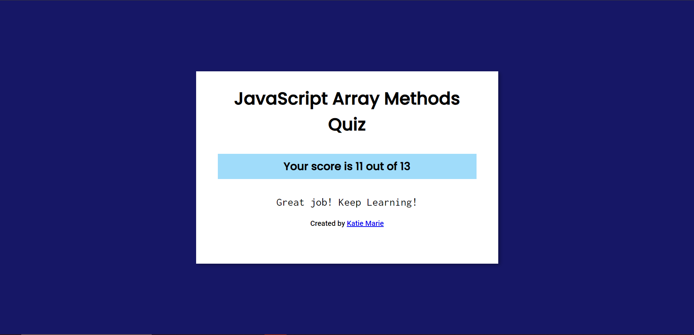

 Write short notes on Array methods with code example ?
.push()
.pop()
. shift()
. unshift()
.includes()
. toString()
. reverse()
. join()
. concat()
. flat()
. slice()
. splice()

Ans
(1)push() Insert an element at the end off an array.

syntax
let arr=[1,2,3,4,5]
 arr.push(6)
console.log(arr)

output-[1,2,3,4,5,6]

(2)pop()-Eliminate the last element from an array.
syntax
 let arr=[1,2,3,4,5]
arr.pop()
console.log(arr);

output-[1,2,3,4]

(3)shift()-Eliminate first element of an array

syntax
let arr=[1,2,3,4,5]
arr.shift()
console.log(arr);

output-[2,3,4,5]

(4)unshift()-insert an element in the starting position of an array

syntax
let arr=[1,2,3,4,5]
arr.shift()
console.log(arr);

output-[2,3,4,5]

(5) includes()- method return true if a string contains a specified string. othrtwise it returns false.

syntax
let arr=[1,2,3,4,5]
console.log(arr.includes(2));

output- true

(6) toString()-used internally by js when object needs to be displayed as a text or when an object needs to be used as a string.

syntax
let arr=["1", "a", "2", "b"]
console.log(arr.toString())

(7) reverse()- method reverse order of the elements in an array.

syntax
let arr=[1,2,3,4,5]
arr.reverse()
console.log(arr);

output-[5,4,3,2,1]

(8) join()- method returns an array as a string.

syntax
let arr=[1,2,3,4,5]
 let newArr=arr.join("-")
console.log(newArr);

output- 1-2-3-4-5

(9) concat() -method returns a new array, containing the joined array.

syntax

let arr1=[1,2,3,4,5]
let arr2=[6,7]
 let arr3=arr1.concat(arr2)
console.log(arr3);

output-[1,2,3,4,5,6,7]

(10) flat() =create a new array with the sub-array element concatenated.

syntax
let arr=[1,2,[3,4],5]
 let NewArr=arr.flat()
console.log(NewArr);

output- [1,2,3,4,5]
(11) slice() -returns a new array with the sliced elements.This method does not modify the original array.

syntax
let arr=[1,2,3,4,5]
 let NewArr=arr.slice(0,2)
console.log(NewArr);

output-[1,2]

(12) splice() -returns a new array with the sliced elements.

syntax

let arr=["one","two","three"]
arr.splice(1,0,"feb")
     console.log(four)

output-["one","two","three","four"]

2 Quiz

3 Write a JavaScript function to check whether an input is an array.
Ans: 
let arr=["one","two","three"]
console.log(Array.isArray(arr));

output-true

4 Write a JavaScript function that takes an array as an argument and returns the first element of the array.
Ans:
let arr=[1,2,3,4]
let firstElement=(Array)=>{
    return Array.shift()
}
let output=firstElement(arr)
console.log(output);

5 Write a JavaScript function that takes an array as an argument and returns the last element of the array.
Ans:
let arr=[1,2,3,4]
let firstElement=(Array)=>{
    return Array.pop()
}
let output=firstElement(arr)
console.log(output);

6 Write a simple JavaScript function to join all elements of the following array into a string.
Sample array : myColor = ["Red", "Green", "White", "Black"];
Ans:
myColor = ["Red", "Green", "White", "Black"]
let joinedArray=(item)=>{
return item.join(" ")
}
let output=joinedArray(myColor)
console.log(output);

7 Write a JavaScript program that accepts a number as input and inserts dashes (-) between each. For example, if you accept 025468 the output should be 0-2-5-4-6-8
Ans:
let number=12345
let numToString=number.toString();
let SplitedArr=numToString.split("")
let joined=SplitedArr.join("-")
console.log(joined);

8 Write a JavaScript function that checks if the given number is even or odd then returns a Boolean value (use: arrow function, return keyword, ternary operator)
Ans:
let number=20
let OddOrEven=(num)=>{
    return num%2===0
}
let output=OddOrEven(number)
console.log(output);

output- true

9 Create an array of guestlist. Write a javascript function that takes the user’s name as an argument and checks if it is there in the guestlist. If yes, return the string “Welcome” else, return “Sorry, good luck next time”.
Ans:
let guestlist=["akash","biju","abhi","junior","aswin","athul"]
let person="akash"
let isInArray=(guestlist,item)=>{
    if(guestlist.includes(item)){
        return "Welcome"
    }
    else{
        return "Sorry! Good luck next time"
    }
}
console.log(isInArray(guestlist,person));

10 Write a javascript function that reverses a given number example: 123456789 => 987654321 (split(), reverse (), join())
Ans:
let number="123456"
let splitted=number.split("")
let reversed=splitted.reverse()
let joined=reversed.join("")
console.log(joined);
